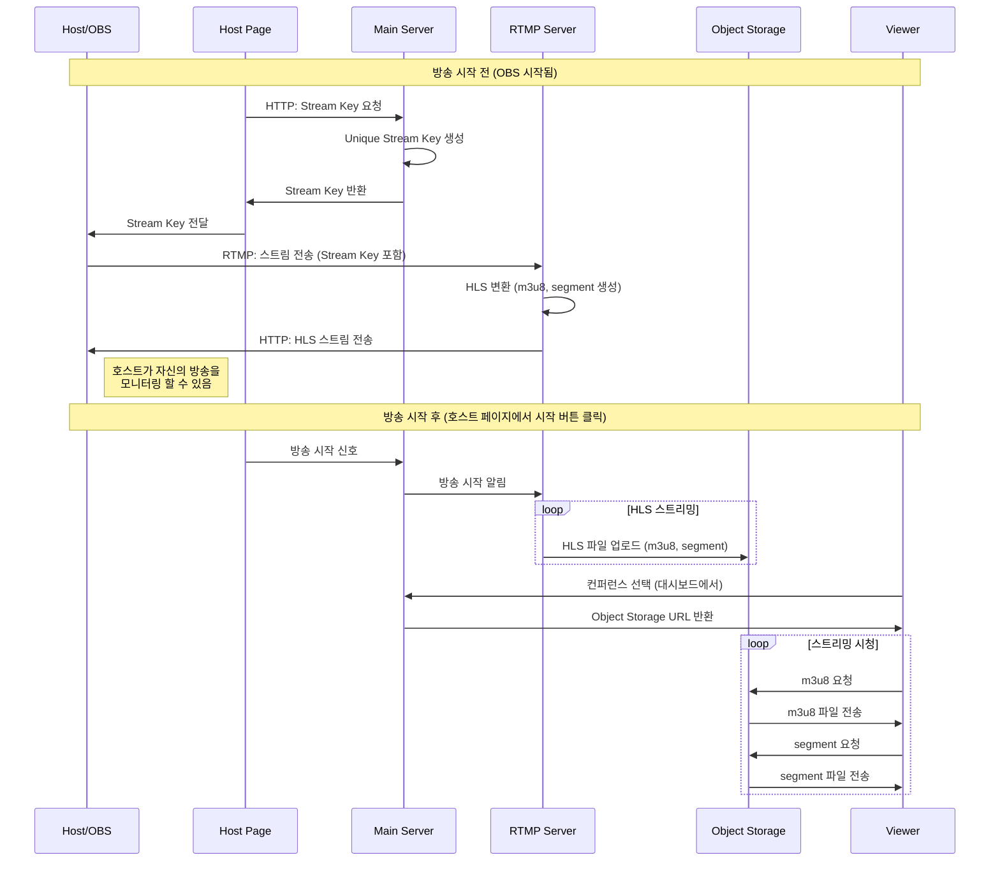

  <h1> 라이부 LiBoo </h1>
  <h3> 컨퍼런스를 더 가까이, LiBoo 에서 라이브로 🚀 </h3>
   
  

  <a href="https://gominzip.notion.site/TEAM-127673f3719e803faf63c70322560d3b?pvs=4"> Notion </a> &nbsp; ｜ &nbsp; 
  <a href="https://www.figma.com/design/op5Ui6oZ4Zx2D8VUgWOKM0/LiBoo-%F0%9F%9A%80?node-id=1-2&node-type=canvas&t=zcYYT1qCtckcUdcs-0"> Figma </a> &nbsp; ｜ &nbsp;
  <a href="https://github.com/boostcampwm-2024/web22-LiBoo/wiki"> Wiki </a> &nbsp; ｜ &nbsp;
  <a href="https://github.com/orgs/boostcampwm-2024/projects/17"> BackLog </a>

 

## 프로젝트 개요

> 토스, 배달의 민족, 카카오 등 다양한 컨퍼런스들이 있지만 실제로 신청해서 당첨되는 것은 쉬운 일이 아닙니다.
>  저희는 이러한 컨퍼런스 문화가 더욱 활발해지고, 더 많은 사람들이 기회를 얻을 수 있기를 바라는 마음으로 LiBoo 프로젝트를 기획하게 되었습니다.
>  작게는 팀원 간 소규모 기술 공유부터, 크게는 네이버 부스트캠프 발표나 기업의 컨퍼런스과도 함께할 수 있는 서비스를 만들고자 합니다!

 

# 📺 핵심 기능

### 실시간 컨퍼런스 스트리밍

실시간 컨퍼런스를 시청하거나 호스트가 되어 컨퍼런스를 직접 스트리밍 할 수 있습니다.

### 실시간 채팅

컨퍼런스를 보며 채팅으로 소통할 수 있습니다. 질문이 있다면 질문 채팅으로 전송이 가능합니다.

### 메인 대시보드

동영상 미리보기, 카테고리 등을 통해 원하는 컨퍼런스를 탐색해 볼 수 있습니다.

### 컨퍼런스 다시보기

실시간으로 방송되었던 컨퍼런스를 다시 돌려볼 수 있습니다.

 

# ⚙️ 서비스 아키텍처

 

# 🛠️ 기술 스택

| Part       | Stack                                                                                           |
| ---------- | ----------------------------------------------------------------------------------------------- |
| 공통       |  |
| 프론트엔드 |  |
| 백엔드     |  |

 

# 🏃 주차별 진행 상황

| 주차  | 내용 요약                                                | 발표자료                                                                                          |
| ----- | -------------------------------------------------------- | ------------------------------------------------------------------------------------------------- |
| 1주차 | 기획 공유 및 팀 목표 설정                                | [보러가기](https://gominzip.notion.site/Week1-Web22-LiBoo-56af3bb7b2314f878667bdbbf99e791f?pvs=4) |
| 2주차 | 백로그 작성, 퍼블리싱, 동영상 스트리밍 아키텍처 설계     | [보러가기](https://gominzip.notion.site/Week2-Web22-LiBoo-137673f3719e805baab4e0a9855ed885?pvs=4) |
| 3주차 | CI/CD, 메인 api 서버 개발, 플레이어 커스텀, 웹소켓 학습 | [보러가기](https://gominzip.notion.site/Week3-Web22-LiBoo-a09dcec3adea4b289d22603df59f24be?pvs=4) |
| 4주차 | 채팅 구현, 서비스 시연 | [보러가기](https://gominzip.notion.site/Week4-Web22-LiBoo-13e673f3719e80e2a6b0cf5fe10d603a) |
| 5주차 |  | [보러가기](https://gominzip.notion.site/Week5-Web22-LiBoo-14c673f3719e80eeb14fe3f1f668e1fc?pvs=4) |

 

# 🔥 기술적 도전

꾸준한 문서화를 통해 지식을 공유하고, 깊이 있는 기술적 도전을 이어나가고자 합니다.

- [[학습] 동영상 스트리밍 처리 프로토콜을 알아보자](https://gominzip.notion.site/b987e92eb6c84eef9af1301877eb7c91?pvs=4)
- [[학습] 웹 소켓의 실시간 양방향 통신](https://gominzip.notion.site/13b673f3719e8037b430ff7b6af397b7?pvs=4)
- [[과정/근거] 패키지 매니저 및 모노레포 정하기](https://gominzip.notion.site/7677c9cf96464b1d9e9c1d8afd4ab0b6?pvs=4)
- [[트러블슈팅] 외부의 사용자가 Object Storage에 접근하지 못하는 권한 제어](https://gominzip.notion.site/Object-Storage-1cf0c1bde758437ea595c57cf704a029?pvs=4)
- [[트러블슈팅] Docker yarn-berry workspace 를 찾지 못하는 오류](https://gominzip.notion.site/docker-yarn-berry-workspace-eff32ce3f695470a8a2d9ef4d02be1e0?pvs=4)

[더 많은 기술정리 보러 가기](https://gominzip.notion.site/12d673f3719e8098ad94ed6b71b10ac0?pvs=4)

 

# TEAM 정권지르기 👊

|                                     김준서                                     |                                     김영길                                     |                                    고민지                                     |                                    김지수                                    |                                    홍창현                                    |
| :----------------------------------------------------------------------------: | :----------------------------------------------------------------------------: | :---------------------------------------------------------------------------: | :--------------------------------------------------------------------------: | :--------------------------------------------------------------------------: |
|  |  |  |  |  |
|                                     **BE**                                     |                                     **BE**                                     |                                    **FE**                                     |                                    **FE**                                    |                                    **FE**                                    |
|                       [@i3kae](https://github.com/i3kae)                       |                    [@hoeeeeeh](https://github.com/hoeeeeeh)                    |                   [@gominzip](https://github.com/gominzip)                    |                    [@jsk3342](https://github.com/jsk3342)                    |                   [@spearStr](https://github.com/spearStr)                   |
